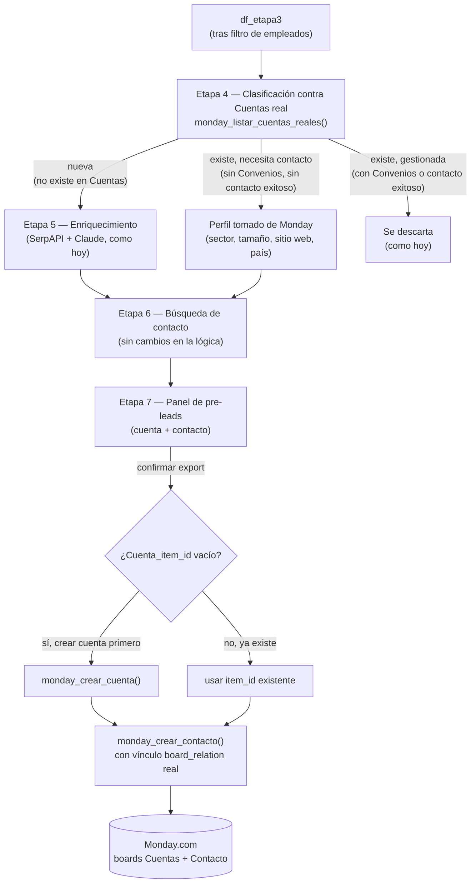

# Tablero de Cuentas — Diseño

**Estado:** aprobado para pasar a plan de implementación.
**Fecha:** 2026-09-09.

## 1. Contexto y objetivo

Hoy la Etapa 4 del pipeline (`app.py`) descarta empresas que ya tienen *al menos un contacto* cargado en el board de Contacto de Monday, leyendo los valores de texto libre de la columna "Cuenta asociada" de ese mismo board. No existe una noción real de "cuenta" — solo de contacto.

El objetivo de este trabajo es introducir el board de Cuentas real de Monday como fuente de verdad de qué empresas ya están cargadas, y cambiar el criterio de descarte: una empresa que ya existe en Cuentas **no se descarta automáticamente** — se descarta solo si ya tiene convenio o un contacto con gestión exitosa. Si no, se le sigue buscando contacto (pero sin repetir el enriquecimiento de perfil, que ya está en Monday).

**Por qué:** hoy se pierden oportunidades de contacto para cuentas que ya están cargadas en Monday pero sin convenio ni contacto exitoso — el pipeline las trata igual que a un cliente ya resuelto.

## 2. Alcance

**Incluye:**
- Clasificación de empresas contra el board de Cuentas real (nueva / existe-necesita-contacto / existe-gestionada).
- Bypass del enriquecimiento de perfil (SerpAPI+Claude) para cuentas que ya existen en Monday.
- Creación de pre-leads de cuenta nueva + contacto, vinculados con un `board_relation` real, exportables con confirmación manual (mismo patrón que hoy).
- Corrección de la columna "Cuenta asociada" del board de Contacto para escribir un vínculo real en vez de texto.

**No incluye (fuera de alcance de este trabajo):**
- Campos de Cuentas no relacionados a este flujo (Eventos, Empleabilidad, Académico, Relacionamiento y ventas, Plan ESG, Documento ESG) — quedan para carga manual posterior, como hoy.
- Gestión de "Convenios" u "Oportunidades" como entidades propias — solo se lee si tienen vínculos, no se crean ni gestionan desde esta app.
- Autenticación, multi-usuario, persistencia propia — fuera del alcance de este prototipo (ver `PROCESO_TECNICO.md`).

## 3. Enfoque elegido

Se extiende el pipeline lineal actual (4 pestañas) en vez de agregar una pestaña/flujo desacoplado. La Etapa 4 pasa de "descartar duplicados" a "clasificar en 3 grupos", y ese grupo determina si la empresa pasa por enriquecimiento completo o va directo a búsqueda de contacto. El panel final de gestión/export pasa a manejar dos tipos de entidad (cuenta + contacto) en vez de solo contacto.

Se descartó una pestaña "Cuentas" separada y desacoplada porque hubiera duplicado la UI de gestión/export ya validada, sin aportar aislamiento real (el resultado igual tiene que alimentar el mismo flujo de contacto).

## 4. Flujo de datos

Notas:
- La clasificación (Etapa 4) es de solo lectura hacia Monday, igual que hoy.
- El grupo "existe, necesita contacto" no pasa por SerpAPI/Claude — su `df` de entrada a la Etapa 6 se arma con las columnas equivalentes tomadas de las columnas de Cuentas (sector, tamaño, sitio web, país, email/teléfono de empresa), para no romper el contrato de entrada de la Etapa 6.
- La Etapa 6 (búsqueda de contacto) no cambia su lógica interna — solo se le suma una columna `Cuenta_item_id` (vacío si la cuenta es nueva, con el id real si ya existía) que viaja hasta el export.

## 5. Componentes nuevos y modificados

| Módulo | Cambio |
|---|---|
| `cuentas.py` (nuevo) | `monday_listar_cuentas_reales()`, `monday_estado_contactos_de_cuenta(cuenta_item_id)`, `monday_crear_cuenta(fila)` — mismo patrón de `monday.py` (GraphQL, `st.cache_data` donde aplique). |
| `monday.py` | `monday_crear_contacto()` cambia de escribir texto en "Cuenta asociada" a setear el `column_value` de tipo `board_relation` con el `item_id` real de la cuenta. |
| `app.py` | Etapa 4 pasa de devolver un set de descarte a devolver 3 `DataFrame` clasificados; Etapa 5 solo corre sobre "nueva"; Etapa 6 recibe la unión nueva+existe-necesita-contacto; pestaña final pasa a mostrar bloques cuenta+contactos y a orquestar el export de dos pasos (cuenta primero, contacto después). |
| `config.py` | `MONDAY_BOARD_CUENTAS`, `MONDAY_COLUMNAS_CUENTAS`, `ESTADOS_CONTACTO_EXITOSO = {"Contactado", "Convenio firmado"}`. IDs reales a confirmar contra la API (sección 7). |

## 6. Reglas de negocio (confirmadas con el usuario)

- **Match de existencia:** nombre del item de Cuentas vs. Razón social del DENUE, normalizado (strip + lower), igual criterio que el dedup actual.
- **Cuenta "gestionada" (se descarta):** tiene al menos un vínculo en la columna "Convenios", **o** tiene al menos un contacto vinculado con Estado en `{"Contactado", "Convenio firmado"}`.
- **Cuenta "necesita contacto":** existe en Cuentas, no cumple la condición anterior.
- **Enriquecimiento:** solo corre para cuentas nuevas. Las existentes usan los datos ya cargados en Monday.
- **Alta de cuenta nueva:** nunca automática — queda como pre-lead, se crea en Monday recién al confirmar el export (mismo patrón que el export de contactos hoy).
- **Vínculo cuenta↔contacto:** `board_relation` real en ambas direcciones (columna "Cuenta asociada" en Contacto, ya tipada como "Relacionado" en el tablero de prueba nuevo).

## 7. Verificación empírica pendiente (antes de codear)

Según la práctica de este proyecto (nunca asumir formato de una API externa), antes de implementar `cuentas.py` y el cambio en `monday_crear_contacto()` hay que confirmar contra la API real de Monday, una vez que la API key apunte al tablero de prueba nuevo:

1. IDs de board y de columna reales de Cuentas y Contacto en el tablero de prueba nuevo.
2. Shape exacto del `column_value` para escribir un `board_relation` (mutación `create_item` / `change_column_value` con `item_ids`).
3. Shape de la respuesta al leer una columna `board_relation` con vínculos (para "Convenios" en Cuentas y "Cuenta asociada" en Contacto).
4. Si `items_page_by_column_values` (o el filtro que corresponda) permite buscar en Contacto por vínculo a un `item_id` de Cuentas específico, para `monday_estado_contactos_de_cuenta()`.

## 8. Manejo de errores

Mismo patrón que el resto del pipeline (fail-per-item, no fail-fast):

- Si falla `monday_crear_cuenta()`, no se intenta `monday_crear_contacto()` para esa fila (evita un contacto sin vínculo real) — se reporta el error puntual y se sigue con las demás filas del lote.
- Si `monday_listar_cuentas_reales()` falla (etapa de clasificación, de solo lectura), se corta la Etapa 4 con un error visible — no tiene sentido continuar sin saber qué ya existe, a diferencia de los loops de la Etapa 5/6.

## 9. Testing

- Verificación empírica de la sección 7 antes de escribir código de integración.
- Para probar la lógica de clasificación y el armado de column_values sin tocar datos reales de Monday: mockear las funciones de `cuentas.py`/`monday.py` (no la lógica de negocio), siguiendo el mismo patrón ya usado en este proyecto cuando una prueba toca datos sensibles — copia de respaldo, reemplazo temporal, restauración al final.
- Casos a cubrir manualmente antes de dar por cerrado: empresa nueva (crea cuenta + contacto vinculados), empresa existente sin convenio/contacto exitoso (salta enriquecimiento, contacto queda vinculado a la cuenta existente), empresa existente con convenio (se descarta), empresa existente con contacto "Contactado" (se descarta).

## 10. Riesgos / puntos abiertos

- El match por nombre de item es exacto (normalizado) — no contempla variaciones de razón social (ej. "S.A. de C.V." vs. sin sufijo). Si en la práctica genera falsos negativos (cuentas existentes no detectadas), habrá que revisar una estrategia de match más tolerante en una iteración futura.
- No hay campo "Nombre" en la Etapa 6 que documente formalmente que el `df` de "existe-necesita-contacto" reemplaza los campos de enriquecimiento por los de Monday — al implementar, hay que mapear explícitamente cada columna de `COLUMNAS_ENRIQUECIMIENTO` a su equivalente de `MONDAY_COLUMNAS_CUENTAS` (o dejarla vacía si no hay equivalente, ej. "Actividad reciente"/"Señal de riesgo" no existen en Cuentas).
